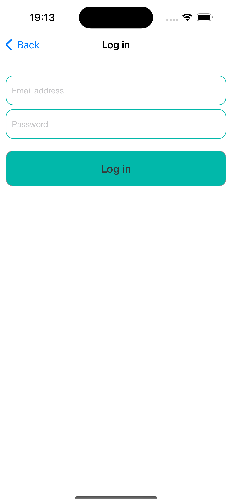
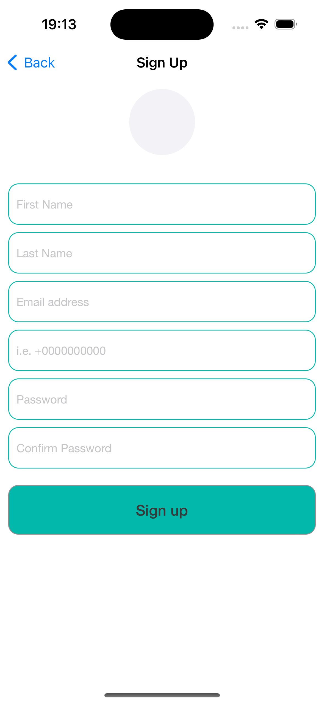
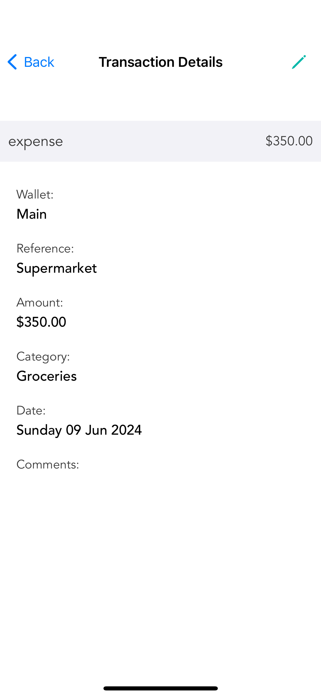
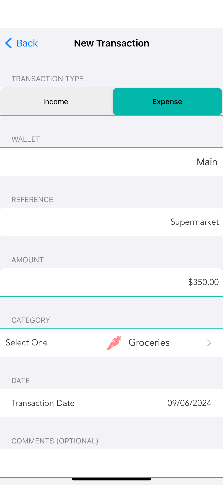
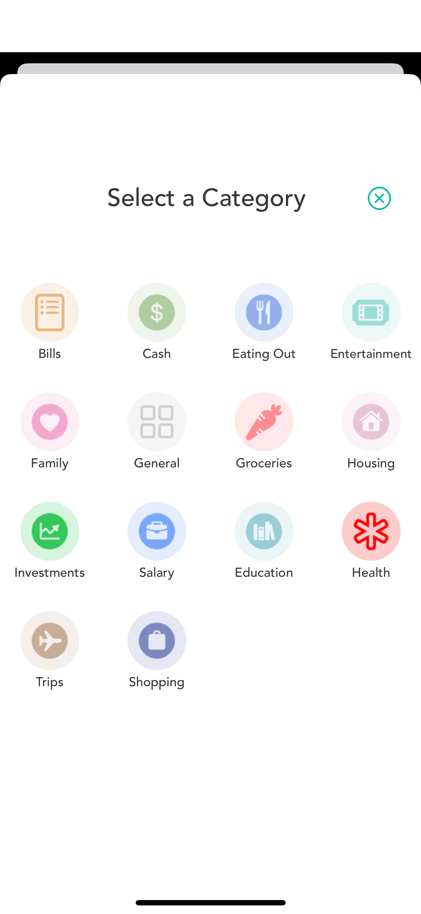
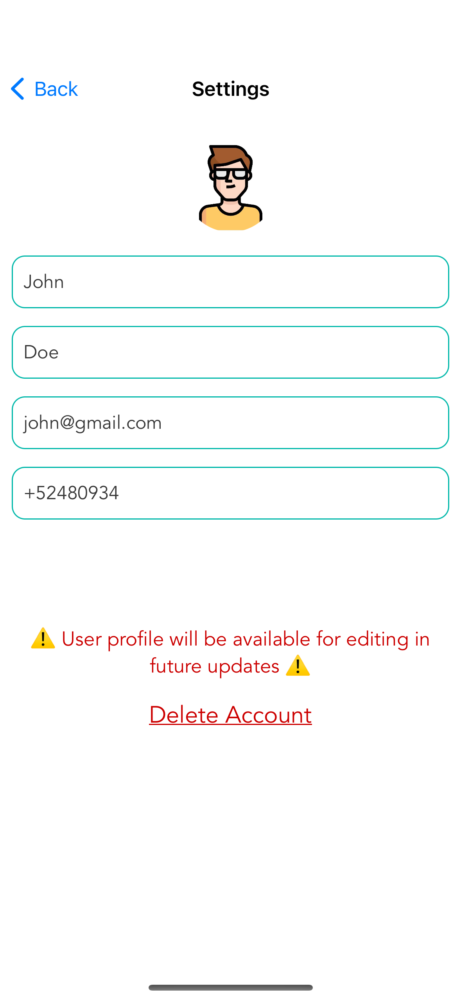

# Handy Budget - Expense Tracker (Former Budget Manager)

Take control of your finances with Handy Budget, the ultimate expense tracker designed to simplify your financial management. Whether you're budgeting for the month or tracking daily expenses, Handy Budget makes it easy to stay on top of your financial goals.

## Features

- Login with email and password.
- Light/dark mode toggle (System).
- Easy Expense & Income Tracking: Log every expense and income effortlessly. Keep a detailed record of where your money goes and where it comes from.
- Detailed Transaction History: View all your transactions in one place. Get detailed insights with categories, dates, and notes for each transaction.
- Range Categories: Tailor the app to fit your lifestyle by using our range of pre-selected categories that match your spending habits.
- User-Friendly Interface: Enjoy a seamless and intuitive experience with our user-friendly design. Perfect for users of all levels, from beginners to budgeting experts.
- Secure and Private: Your financial data is safe with us. Handy Budget ensures your information is securely stored, giving you peace of mind.

## Color Reference

| Color             | Hex                                                                |
| ----------------- | ------------------------------------------------------------------ |
| Dark Mode Expense Label Color |  #FF5050 |
| Light Mode Expense Label Color |  #CC0000 |
| Light Mode Color |  #FFFFFF |
| Dark Mode Color |  #383838 |
| Label & Button Color |  #01B8AA |

## Tech Stack

- MVC
- UIKit
- SDKS: Firebase, Coredata, ProgressHUD
- Firebase Analytics and Craslytics

## Logo

## Screenshots

- SignIn with Email  

- SignUp  

- Home screen  

- Transaction details screen  

- Transaction management screen  

- Category Selection  

- User settings screen  

 
 
Images subject to be changed during the app development
