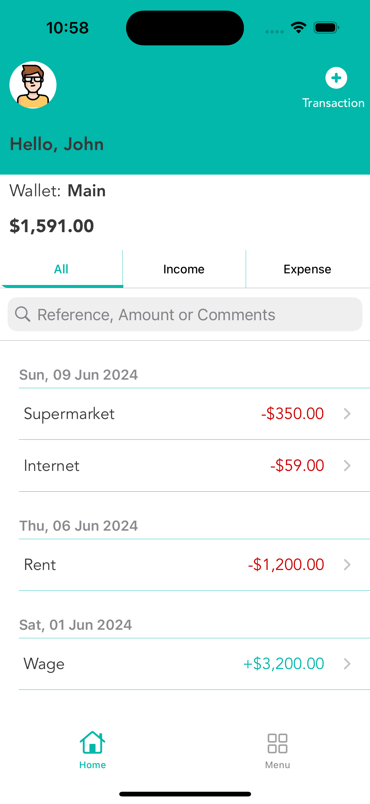

# Budget Manager

Budget Manager is an application where you can keep track of every expense or income you have. This app allows you see all transactions and their details.

## Features

- Login with third party apps (Google, Facebook and Apple)
- Light/dark mode toggle (System)
- List of transactions by type: Expense and Income
- Transaction Details
- Transaction management (Create and Edit)

## Color Reference

| Color             | Hex                                                                |
| ----------------- | ------------------------------------------------------------------ |
| Dark Mode Expense Label Color |  #FF5050 |
| Light Mode Expense Label Color |  #CC0000 |
| Light Mode Color |  #FFFFFF |
| Dark Mode Color |  #383838 |
| Label & Button Color |  #01B8AA |

## Tech Stack

- MVC
- UIKit
- SDKS: Firebase, Google SignIn, Facebook SignIn, ProgressHUD
- @API (https://github.com/jadsonsts/API_BudgetManager) Integration
- MySQL database

## Logo

## Screenshots

#Login with other accounts

#SignIn with Email

#SignUp

#Home screen

#Transaction details screen

#Transaction management screen

#User settings screen

"Images subject to be changed during the app development"
